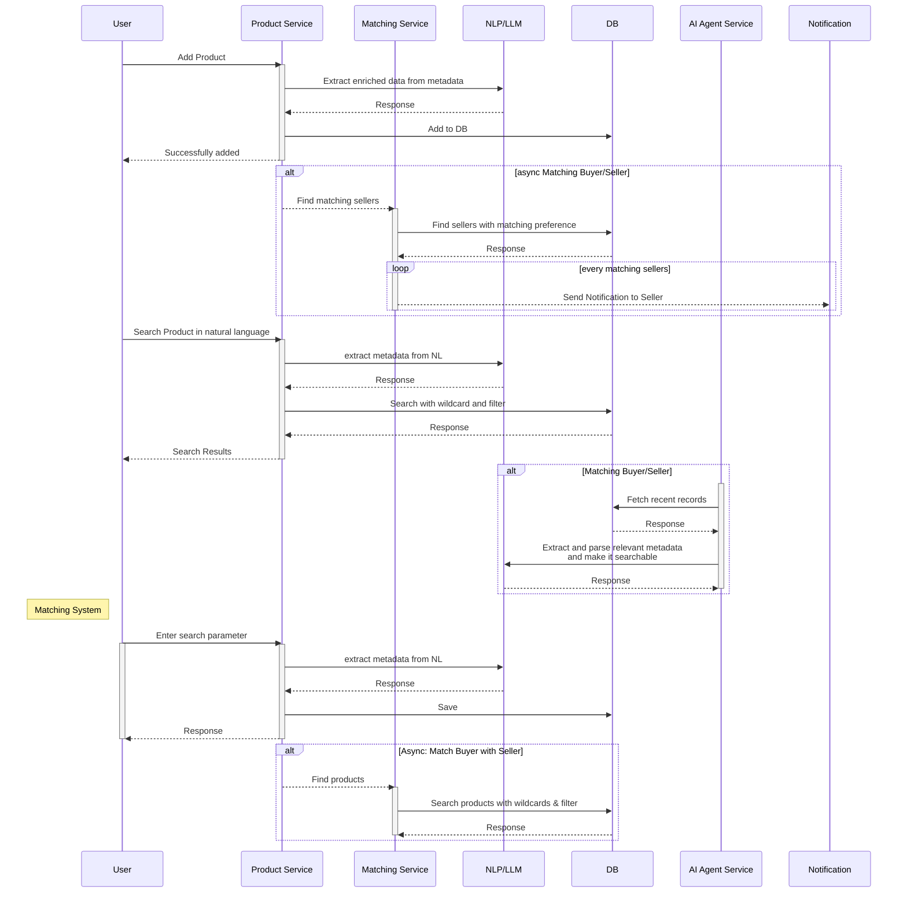

Think of this as a backend app for an LLM powered marketplace backend app.

```mermaid
sequenceDiagram
    participant User
    participant Product_Service as Product Service
    participant Matching_Service as Matching Service
    participant LLM as NLP/LLM
    participant DB
    participant AI_Wrapper as AI Agent Service
    participant Notification


    User ->> Product_Service: Add Product
    activate Product_Service
        Product_Service ->> LLM: Extract enriched data from metadata
        LLM -->> Product_Service: Response
        Product_Service ->> DB: Add to DB
        Product_Service -->> User: Successfully added
    deactivate Product_Service


    alt async Matching Buyer/Seller
        Product_Service -->> Matching_Service: Find matching sellers
        activate Matching_Service
            Matching_Service ->> DB: Find sellers with matching preference
            DB -->> Matching_Service: Response
            loop every matching sellers
                Matching_Service -->> Notification: Send Notification to Seller
            end
        deactivate Matching_Service
    end

    User ->> Product_Service: Search Product in natural language
    activate Product_Service
        Product_Service ->> LLM: extract metadata from NL
        LLM -->> Product_Service: Response
        Product_Service ->> DB: Search with wildcard and filter
        DB -->> Product_Service: Response
        Product_Service -->> User: Search Results
    deactivate Product_Service


    alt Matching Buyer/Seller
        activate AI_Wrapper
            AI_Wrapper ->> DB: Fetch recent records
            DB -->> AI_Wrapper: Response
            AI_Wrapper ->> LLM: Extract and parse relevant metadata <br/> and make it searchable
            LLM -->> AI_Wrapper: Response
        deactivate AI_Wrapper
    end

    note left of User: Matching System
    User ->> Product_Service: Enter search parameter
    activate User
        activate Product_Service
            Product_Service ->> LLM: extract metadata from NL
            LLM -->> Product_Service: Response
            Product_Service ->> DB: Save
            Product_Service -->> User: Response
        deactivate Product_Service
    deactivate User

    alt Async: Match Buyer with Seller
        Product_Service -->> Matching_Service: Find products
        activate Matching_Service
            Matching_Service ->> DB: Search products with wildcards & filter 
            DB -->> Matching_Service: Response
        deactivate Matching_Service
    end
``` 