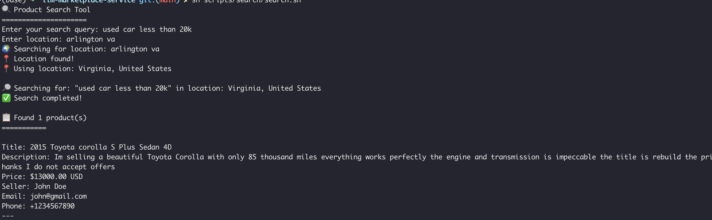
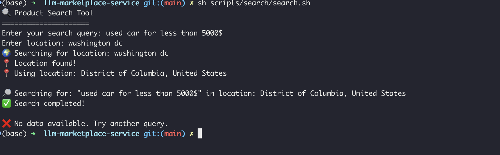

## Think of this as a backend app for an LLM powered marketplace backend app.
Seller posts ad for a product for sale.  
Buyer can query in natural language what they are looking for. LLM will extract relevant metadata and do a search based on extracted and meaningful parsed data.  
For example:   
iPhone 15 pro under 800$ near Washington DC.  
wedding photographer in Manhattan, New York, under 500$  

#### Actual code is private ofcourse (in case I think of actually building the whole damn thing)  
Actual credit goes to Claude Code + Cursor for doing 95% of the work. 

### Sequence Diagram

### Seller added an ad for a car with the following metadata
- "title": "2015 Toyota corolla S Plus Sedan 4D",
- "description": "Im selling a beautiful Toyota Corolla with only 85 thousand miles everything works perfectly the engine and transmission is impeccable the title is rebuild the price is negotiable only serious buyers thanks I do not accept offers",
- price: 13000  

### Buyer puts in a query in natural language

#### Sample #1

#### Sample #1 - No Data
